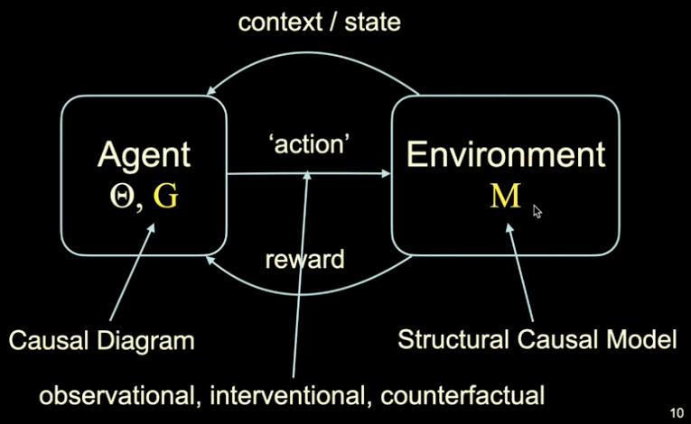
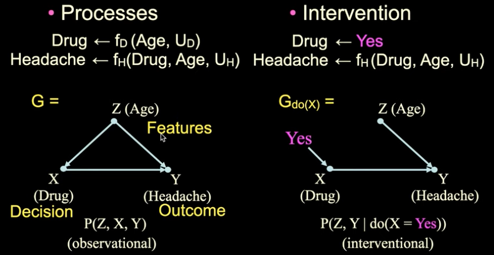
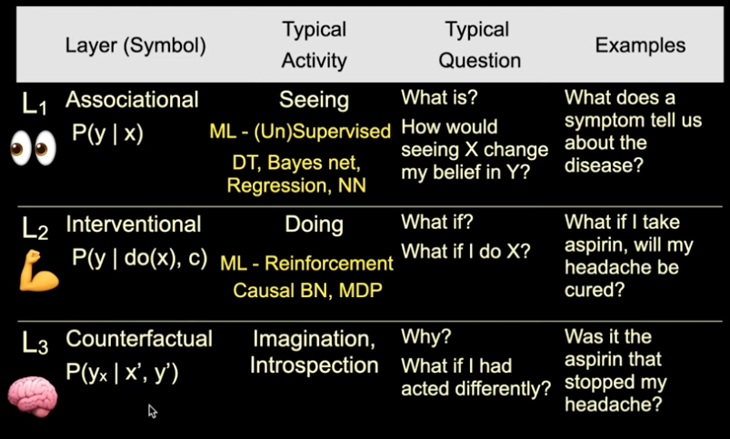
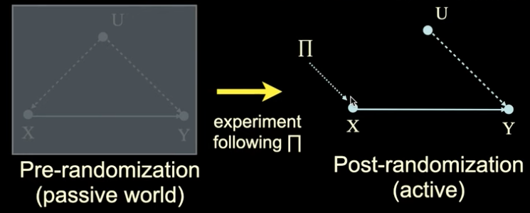

# Causal Reinforcement Learning

ICML 2020 Tutorial: [website link](https://crl.causalai.net/)

You Tube Videos: [Part 1](https://www.youtube.com/watch?v=QRTgLWfFBMM) - [Part 2](https://www.youtube.com/watch?v=2hGvd_9ho6s)

## Notes/Key Takeaways

### Introduction

Goal of the tutorial was to introduce a common language and understanding between RL and CI domains.

- Reality can be decomposed into causal elements - **structural causal models**
- Exhibit the feature of **autonomy**/**modularity**
- Reality exists, and it is modular - can be decomposed as a collection of causal mechanisms
- Two sides of the structural model:
  - **Explainability**: Effect identification and decomposition, bias analysis and fairness, robustness and generalisability
  - **Decision-Making**: RL, randomised control trials, personalised decision-making.
  - Some interaction between these two - if you understand more about the system you can be more accurate in the bringing about the change you're looking for.

What is causal RL?
- Reinforcement Learning (RL) is great at handling sample complexity and credit assignment (delayed reward/gratification)
- Causal inference (CI) is great at leveraging structural invariances across settings, conditions and environments
- Can we have the best of both worlds?
- Simple solution:
  - Causal RL = CI + RL
  - Want to provide a cohesive framework that takes advantage of the capabilities of both formalisms (from first principles), and that allows us to develop the next generation of AI systems.

### Part 1: Foundations of CRL

- RL exhibits **adaptive learning**: each action is tailored for the evolving covariates and actions' history
- Learning without having a full specification of the system; versus planning/programming

- The environment and the agent will be tied through the pair SCM $M$ (environment side) and causal graph $G$ (agent's "mind")
- We'll define difference types of actions, or interactions, to avoid ambiguity (PCH)

#### Structural Causal Model (SCM)

- Representing the data generating model

- Can sample from the process on the left, giving rise to $P(Z,X,Y)$
- On the right, we are fixing the process so that the Drug is always administered
  - Usually, this might instead be random (randomised trial), or could be a function of one of the other variables (like age)
- If we can contrive a situation in the world matching the right then we can sample from the process
  - Gives rise to the _experimental/interventional distribution_
- A *structural causal model, M* (or, data generating model) is a tuple ($V$, $U$, $F$, $P(u)$)
  - $V$ are _endogeneous_ (i.e., observable) variables
  - $U$ are  _exogeneous_ (i.e. unobservable) variables
  - $F$ are functions determining $V$, for each $V_i \leftarrow f_i(Pa_i, U_i)$ where $Pa_x \subset V, U_i \subset U$
    - They listen to the observable and unobservable variables
  - $P(u)$ is a distribution over $U$
- SCM $M$ (an instantiation of the object) implies the _Pearl Causal Hierarchy (PCH)_
  - See the _Book of Why_
  - Different levels/rungs
  - **Counterfactual**: We have the _factual_, or what did happen and was observed. In the _counterfactual_ case we want to consider what the observation still have happened if we didn't take the action we did.

- Counterfactual is the most detailed layer

#### Casual Hierarchy Theorem (CHT)

Given that an SCM $M$ $\rightarrow$ PCH, we can show the following:

_Theorem CHT: With respect to Lebesgue measure (over a suitable encoding of $L_3$-equivalence classes of) SCMs, the subset in which any Pearl Causal Hierarchy (PCH) collapse is measure zero._

Informally, for almost any SCM (i.e., almost any possible environment), the PCH does not collapse, i.e. the layers of the hierarchy remain distinct. One is strictly more powerful than the other. It is not the case that there are simply facts about the world we're unaware of.

Corollary: to answer questions at Layer i (about a certain action), one needs knowledge at layer i or higher.

Causal interference is non-trivial as SCMs are almost never fully observed. Exceptions are in Physics, Chemistry, Biology, which learn about the mechanisms at a very detailed level. For most of the settings in which we introduced AI, the SCM is not observed. Usually humans are involved in some way $\rightarrow$ never clean.

Layer 1 underdetermines layer 2 $\rightarrow$ cannot move from $L_1$ to $L_2$.

Causal graph $G$ conveys structural constraints:
- Templates (MDP, multi-arm bandit (MAB)) - assumption that world conforms to some cookie-cutter pattern
- Knowledge engineering - extra information about the environment; encoding some form of constraints
- Causal discovery

Key points, so far
- The environment (mechanisms) can be modelled as an SCM
  - SCM $M$ (a specific environment) is rarely observable
- Still, each SCM $M$ can be probed through qualitatively different types of interactions (distributions) - the PCH - i.e.
  - $L_1$: Observational
  - $L_2$: Interventional
  - $L_3$: Counterfactual
- CHT: For almost any SCM, lower layers underdetermine higher layers
  - This delimits (constrains) what an agent can infer based on the different types of interactions (and data) it has with the environment
  - For instance, from passively observing the environment ($L_1$), it cannot infer how to act ($L_2$)
  - From intervening in the environment ($L_2$), it cannot infer how things would have been had the agent acted differently ($L_3$)
- Causal graph $G$ is a surrogate of the invariances of the SCM $M$

#### Current Methods

Goal: Learning a policy $\pi$ such that a sequence of actions $\pi(\cdot)=(X_1,X_2,\ldots,X_n)$ maximises the reward $\mathbb{E}_\pi[Y|do(X)]$.

Current strategies found in literature:
- Online learning: agent performs experiments itself ($\rightarrow$ do(x))
- Off-policy learning: agent learns from other agents' actions (do(x) $\rightarrow$ do(x))
- Do-calculus learning: agent observes other agents acting (see(x) $\rightarrow$ do(x))

Both the second and third pints are offline. In the second bullet we know why the agent being observed did what it did, in the third bullet point we don't know whether the agent acted purposefully or not.

##### Online Learning

Finding x* is immediate once $\mathbb{E}_\pi[Y|do(X)]$ is learned. $\mathbb{E}_\pi[Y|do(X)]$ can be estimated through randomised experiments or adaptive strategies
- Pros: Robust against _unobserved confounders (UCs)_: variables that effect more than one observable
- Cons: Experiments can bu expensive, impossible, expensive or unethical

##### Covariate-Specific Causal Effects (Contextual)

Model can be augmented to accommodate set of observed covariates C (also known as context); U is the set of (remaining) unobserved confounders (UCs).

The goal is to learn a policy $\pi(c)$ so as to optimise based on the c-specific causal effect, $P(Y|do(X),C=c)$.

##### Off-Policy Learning

$\mathbb{E}_\pi[Y|do(X)]$ can be estimated through experiments conducted by other agents and different policies.
- Pros: no experiments need to be conducted
- Cons: relies on assumptions that:
  - the same variables were randomised/controlled
  - context matches

##### Do-Calculus Learning

$\mathbb{E}_\pi[Y|do(X)]$ can be estimated from non-experimental data (also called _natural_ or _behavioural_ regime)
- Pros: estimation is feasible even when context is unknown and experimental variables do not match (i.e., off-policy assumptions are violated)
- Cons: Results are contingent on the model; for weak models, effect is not uniquely computable (not ID)

### Part 2: 

Consider six different tasks; focus will be on three of these.

#### Task 1: Generalised Policy Learning (combining online and offline learning)
Usually undesirable to perform online learning. Want to leverage data collected under different conditions to accelerate learning, without starting from scratch. However, the conditions required by offline learning are not always satisfied in many practical, real-world settings.

Want to move towards realistic learning scenarios where the modalities come together, including when the most traditional, and provably necessary, assumptions do not hold.

Robotics example: learning by demonstration when the teacher can observe a richer context (e.g., more accurate sensors).

Shows a good example where observational data was retained and used when performing exploration (i.e. when we move from the _"seeing"_ to the _"doing"_ paradigm). A problem is encountered whereby there is a mismatch between $\mathbb{E}[Y|X]$ and $\mathbb{E}[Y|do(X)]$, which leads to the prior information damaging the agent's performance (higher cumulative regret it obtained). Reducing the number of prior information is beneficial to agent performance, rather than detrimental.

The solution is to bound $\mathbb{E}[Y|do(X)]$ from observations $P(x,y)$. Given the observations coming from an distribution $P(x,y)$, the average causal effect $\mathbb{E}[Y|do(X)]$ is bounded in $[l_x,h_x]$, where $l_x=\mathbb{E}[Y|x]P(x)$ and $h_x=l_x+1-P(x)$

#### Task 2: When and where to intervene? (refining the policy space)

In general, it is assumed that there is a policy space such that actions are fixed a-priori (e.g., a set $X=\{X_1,\ldots,X_k\}$), and intervening is usually assumed to lead to positive outcomes. Want to understand when interventions are required, or if they may lead to unintended consequences. In the case interventions may be needed, we would like to understand what should be changed in the underlying environment so as to bring a desired state of affairs about (e.g., rather than pulling all levers, determine which ones we should pull). 

#### Task 3: Counterfactual Decision-Making

Agents act in a reflexive manner, without considering the reasons (or causes) for behaving in a particular way. Whenever this is the case, they can be exploited without ever realising. This is general phenomenon in online learning - all known RL algorithms are causal-insensitive.

Goal is to endow agents with the capability of performing counterfactual reasoning (taking their own intent into account), which leads to a more refined notion of regret and a new OPT function.